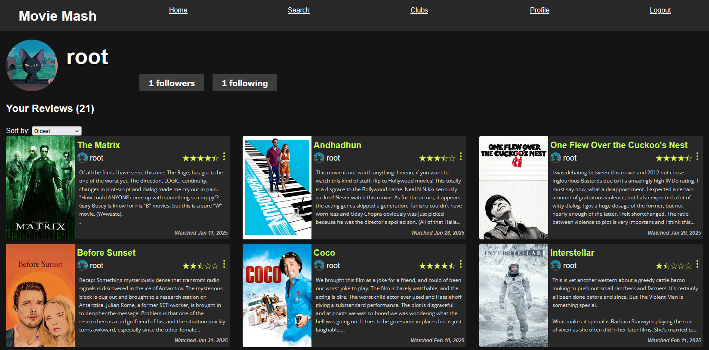
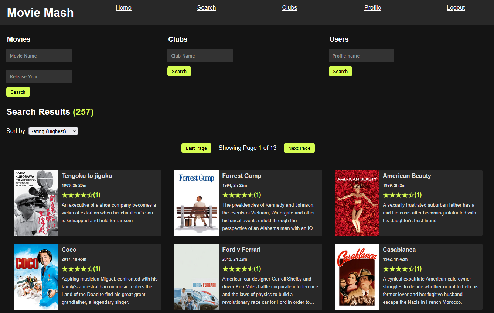
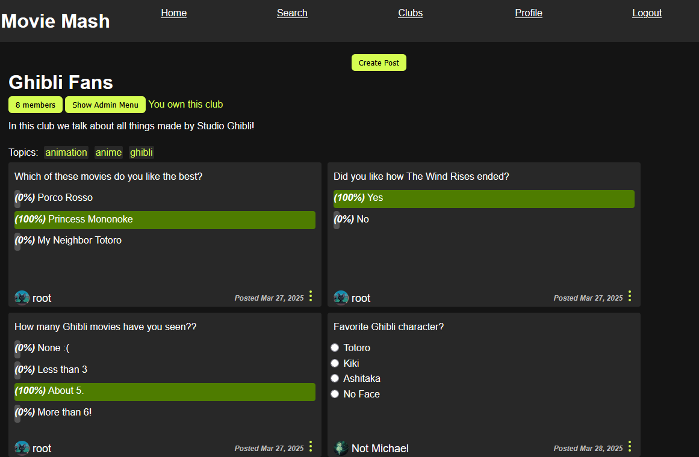
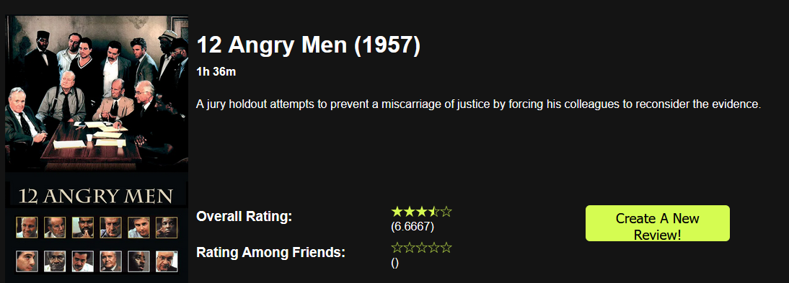

<div align="center">
<h1>Movie Mash</h1>
<p>
A PHP & MySQL movie review web application with Docker support.
  <br/>
  Users can search, filter, and view movie reviews, and join and post polls in clubs.
  
</p>




</div>


## Features


- Search for movies by title and release year
- Sort by release date, title, or average rating
- Pagination for large result sets
- Shows average ratings from reviews
- Session-based user authentication
- Create reviews for movies, and polls about different movie topics
- Follow your friends to see their recent reviews


<table style="border:0px;">
  <tr>
    <td>


          
_Search Page: Can search for movies, clubs, and users._
          
</td>

<td>


            
_Example of a club containing polls and reviews._
          
</td>
          
  </tr>
  
</table>




## Organization
This repository holds:
- `www`: Front-end PHP server code
- `mysql-init`: Scripts to load demo schema and data into MySQL
- `docker-compose.yml`: Docker Compose setup for PHP and MySQL


> [!NOTE]
> Demo database credentials are set in both [docker-compose.yml](docker-compose.yml) and [db.php](www/config/db.php).


## Setup

> [!Important]
> This app requires Docker Compose. If you prefer manual setup, you must have PHP and MySQL installed, and should change the value of `$servername` in [db.php](www/config/db.php) to "127.0.0.1".

To run a demo of this project:

1) Clone the repository

2) Build and run the containers

```bash
docker-compose up --build
```

3) Open your browser and navigate to the landing page at http://localhost:8080/landing.php


4) Create a new account, or use the following default account:

- `Username`: root
- `Password`: password


To end the server, run 
```
docker-compose down
```


## Data Sources

The dummy data used in this demo can be found at the following sources. The views reflected/expressed by this content do not reflect the actual views of the author, and was merely used as placeholder data.

- Movie Data: [kaggle/harshitshankhdhar](https://www.kaggle.com/datasets/harshitshankhdhar/imdb-dataset-of-top-1000-movies-and-tv-shows?resource=download)

- Sample Review Data: [kaggle/lakshmi25npathi](https://www.kaggle.com/datasets/lakshmi25npathi/imdb-dataset-of-50k-movie-reviews)

- Additional Movie Data: [Open Movie Database API](https://www.omdbapi.com/)

- Random Profile Data: [randomuser.me](https://randomuser.me/)


The scripts used to parse and format this data can be found in [/data-formatting](data-formatting).

